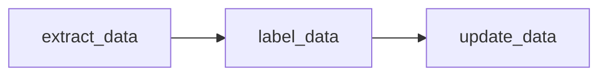

# CS410: Text Information Systems Final Project

## Project Overview

This project performs Sentiment Analysis on Reddit comments in UkrainianConflict subreddit. Our data pipeline connects to a Reddit application to facilitate the scraping of comments from UkrainianConflict using the Python PRAW library. After we scrape the data we use the NLTK Vader Sentiment Analyzer Python library to label it. Our results are displayed on a Plotly Dash application.

## Data Pipeline

The data pipeline consists of three independent scripts. The scripts are decoupled
from each other and each generates an output dataset.

Data is extracted through the Reddit API.

**Steps to reproduce the data pipeline:**

1. [Register for a Reddit Account](https://www.reddit.com/register/)
2. [Create Application on Reddit](https://www.reddit.com/prefs/apps)
3. [creds-example.json](/extract_data/creds-example.json) add **client_id, client_secret, and user_agent**
4. [Execute extract_data.py](/extract_data/extract_data.py)
   - [Example raw comments dataset](/extract_data/data/UkrainianConflict-comments.csv)
   - [Example raw headlines dataset](/extract_data/data/UkrainianConflict-headlines.csv)
5. [Execute label_data.py](/extract_data/label_data.py)
   - [Example labeled comments dataset](/extract_data/data/UkrainianConflict-comments-labeled.csv)
   - [Example labeled headlines dataset](/extract_data/data/UkrainianConflict-headlines-labeled.csv)
6. [Execute update_data.py](/extract_data/update_data.py) , wait at least 24 hrs to give community time to upvote
   - [Example updated labeled comments dataset](/extract_data/data/UkrainianConflict-comments-labeled-updated.csv)

## Sentiment Analysis

Raw data is labeled -1 (Extremely Negative) to 1 (Extremely Positive) using NLTK vader_lexicon.
We combine sentiment analysis with contextual data from Reddit, upvotes, this enables a more
clear understanding of community sentiment of the headline and comment.

## Data Visualization App

## Emotions Research

## References

## Team

| Author           | Email                   | Contribution
|------------------|-------------------------|------------
| Binod Pandey     | bpand3@illinois.edu     | Coding, Documentation, Demo
| Charles Stolz    | cstolz2@illinois.edu    | Coding, Documentation, Demo
| Michael Gambino  | mgambin2@illinois.edu   | Coding, Documentation, Demo
