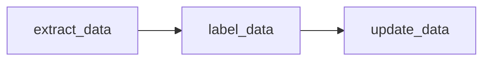
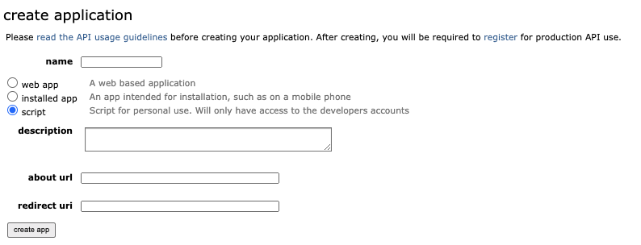
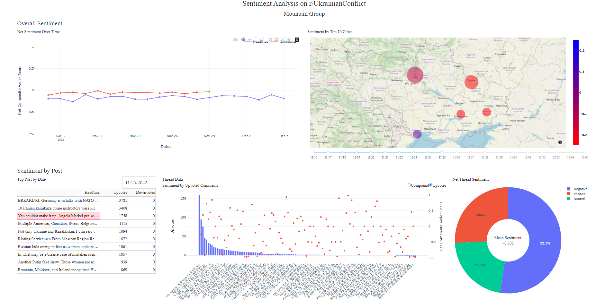
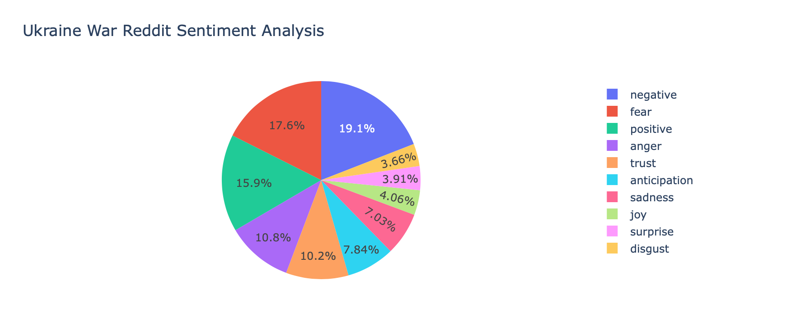
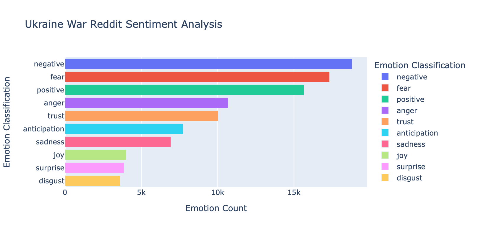

# CS410: Text Information Systems Final Project

## Project Overview

This project performs Sentiment Analysis on Reddit comments in UkrainianConflict subreddit. Our data pipeline connects to a Reddit application to facilitate the scraping of comments from UkrainianConflict using the Python PRAW library. After we scrape the data we use the NLTK Vader Sentiment Analyzer Python library to label it. Our results are displayed on a Plotly Dash application.

## Data Pipeline

The data pipeline consists of three independent scripts. The scripts are decoupled
from each other and each generates an output dataset.

Data is extracted through the Reddit API.

**Steps to reproduce the data pipeline:**

1. [Register for a Reddit Account](https://www.reddit.com/register/)
2. [Create Application on Reddit](https://www.reddit.com/prefs/apps)
   
3. [creds-example.json](/extract_data/creds-example.json) add **client_id, client_secret, and user_agent**
4. [Execute extract_data.py](/extract_data/extract_data.py)
   - [Example raw comments dataset](/extract_data/data/UkrainianConflict-comments.csv)
   - [Example raw headlines dataset](/extract_data/data/UkrainianConflict-headlines.csv)
5. [Execute label_data.py](/extract_data/label_data.py)
   - [Example labeled comments dataset](/extract_data/data/UkrainianConflict-comments-labeled.csv)
   - [Example labeled headlines dataset](/extract_data/data/UkrainianConflict-headlines-labeled.csv)
6. [Execute update_data.py](/extract_data/update_data.py) , wait at least 24 hrs to give community time to upvote
   - [Example updated labeled comments dataset](/extract_data/data/UkrainianConflict-comments-labeled-updated.csv)

## Sentiment Analysis

Raw data is labeled -1 (Extremely Negative) to 1 (Extremely Positive) using NLTK vader_lexicon.
We combine sentiment analysis with contextual data from Reddit, upvotes, this enables a more
clear understanding of community sentiment of the headline and comment.

## Data Visualization App

To tell the story regarding the sentiment of the Ukrainian war by the UkrainianConflict subreddit, we built a dashboard through Plotly Dash. The first story we look to show on the top left is the overall sentiment of headlines and posts across time, showing how sentiment is trending and correlating with present day events. The second story on the top right is regarding the overall volume and sentiment of posts corresponding to certain cities across the country, which helps to highlight where are the most critical events occurring and what is the sentiment according to Reddit. Lastly, on the bottom, we show the top posts by date and to their respective thread comments and net sentiment, showing what the conversation and sentiment is really like for some of the top articles of the day.

To reproduce the dashboard,
1. Create and activate a virtual environment (preferably through conda) with Python 3.9.13
2. Clone /dashboard into local environment
3. pip install -r /dashboard/requirements.txt
4. Run app.py and view on http://127.0.0.1:8050/

## Emotions Research
Emotion analysis is pretty new field within Sentiment Analysis. Emotion Analysis parses input document and provides emotions as output. While there are different libraries that output different emotions, we have chosen to use NRCLexicon library to parse our documents. NRCLexicon has fear, anger, anticipation, trust, surprise, positive, negative, sadness, disgust, and joy as the categories of emotions. In our project we are passing headlines of the Ukraine war from reddit as document and extracting emotions out of these headlines. These emotions are labeled are either 1(exists) or 0(does not exist) across all the emotions. If there are more than 1 emotion of the same type within a document, it increases the number for that particular emotion. Finally, we look at overall emotions across headlines and see which emotions are more prevalent. Since we are extracting headlines of Ukraine War, we expected to see more negative emotions than positive ones, and the diagram proves that as well. Negative, fear, anger, sadness, disgust are consistently over 50%.

# Libraries used for Emotions
NRCLex, pandas, and plotly.express

**Steps to reproduce the emotions**
1. [Follow instructions above to create data pipeline if not done already
2. [Execute emotions.py](/extract_data/emotions.py)

## Emotions Visualization

## References
##https://medium.com/geekculture/simple-emotion-classification-in-python-40fb24692541

## Team

| Author           | Email                   | Contribution
|------------------|-------------------------|------------
| Binod Pandey     | bpand3@illinois.edu     | Coding, Documentation, Demo
| Charles Stolz    | cstolz2@illinois.edu    | Coding, Documentation, Demo
| Michael Gambino  | mgambin2@illinois.edu   | Coding, Documentation, Demo
